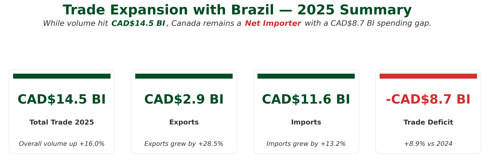
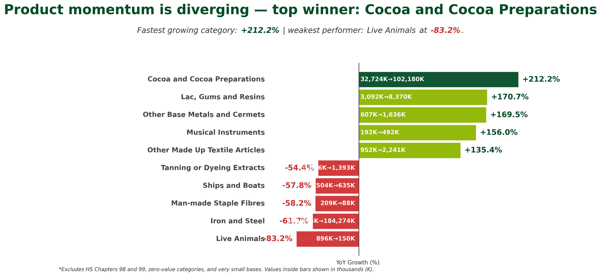
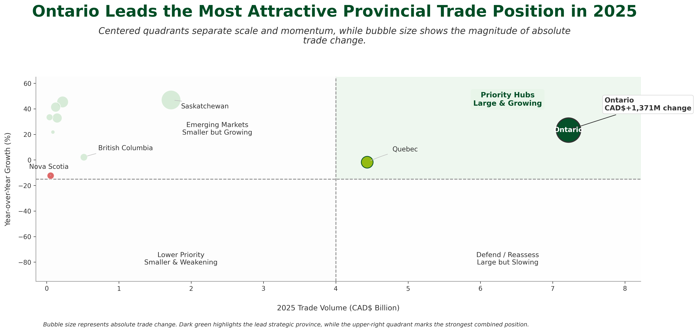

# 🇨🇦 Canada–Brazil Trade Opportunities Analysis

## Executive Trade Analytics Project

An executive-level analysis of Canada–Brazil merchandise trade performance using Python, data analytics, forecasting, and business intelligence techniques.

This project evaluates bilateral trade trends, import-export dynamics, product performance, provincial trade concentration, and future trade outlook to support strategic decision-making.

---

## 📊 Project Overview

The objective of this project was to analyze Canada–Brazil merchandise trade activity and answer key business questions:

* How has trade volume evolved?
* What is driving growth?
* How balanced is the trade relationship?
* Which product categories are expanding or declining?
* Which provinces are driving trade activity?
* What trade volume can be expected in 2026?

The final deliverable is an executive-style analytical report designed for stakeholders, decision makers, and business leaders.

---

## 🎯 Business Questions

### Trade Performance

* How much did Canada–Brazil trade grow?
* What is the current trade balance?
* Are exports keeping pace with imports?

### Product Analysis

* Which product categories are growing fastest?
* Which categories are declining?
* Is growth diversified or concentrated?

### Geographic Analysis

* Which provinces dominate trade activity?
* Which provinces show the strongest momentum?
* Where are the strongest investment opportunities?

### Forecasting

* What is the expected trade volume for 2026?
* Which forecasting approach performs best?

---

## 🛠️ Tools & Technologies

### Data Analysis

* Python
* Pandas
* NumPy

### Visualization

* Matplotlib
* Executive Reporting Design

### Analytics

* Exploratory Data Analysis (EDA)
* Trend Analysis
* Growth Analysis
* Forecasting
* Business Intelligence

### Data Source

* Statistics Canada
* Canadian International Merchandise Trade Database

---

## 📂 Dataset

### Source

Statistics Canada – Canadian International Merchandise Trade Database

### Coverage

* January 2024 – December 2025
* Canadian Exports to Brazil
* Canadian Imports from Brazil
* Product Chapters
* Provincial Trade Activity

### Metrics Analyzed

* Trade Volume
* Exports
* Imports
* Trade Balance
* Provincial Trade Share
* Product Growth Rates
* Forecast Accuracy

---

## 🔄 Project Workflow

```text
┌─────────────────────────────┐
│ Statistics Canada Trade Data│
└──────────────┬──────────────┘
               │
               ▼
┌─────────────────────────────┐
│ Data Validation             │
│ Missing Values • Duplicates │
│ Quality Checks              │
└──────────────┬──────────────┘
               │
               ▼
┌─────────────────────────────┐
│ Data Cleaning & Preparation │
│ Pandas • Transformation     │
│ Standardization             │
└──────────────┬──────────────┘
               │
               ▼
┌─────────────────────────────┐
│ Feature Engineering         │
│ Growth Rates • Trade Mix    │
│ Provincial Metrics          │
└──────────────┬──────────────┘
               │
               ▼
┌─────────────────────────────┐
│ Exploratory Analysis        │
│ Trade Trends • Products     │
│ Provincial Performance      │
└──────────────┬──────────────┘
               │
               ▼
┌─────────────────────────────┐
│ Forecast Modeling           │
│ Baseline Scenario           │
│ Validation Metrics          │
└──────────────┬──────────────┘
               │
               ▼
┌─────────────────────────────┐
│ Executive Insights          │
│ Recommendations             │
│ Strategic Opportunities     │
└──────────────┬──────────────┘
               │
               ▼
┌─────────────────────────────┐
│ FCBB Executive Trade Report │
└─────────────────────────────┘
```

---

## 📄 Executive Report

### Download Full Report

📥 [Download the Executive Trade Report](reports/fcbb-canada-brazil-trade-report.pdf)

The report provides a comprehensive analysis of Canada–Brazil merchandise trade performance, including:

* Trade Growth Trends
* Import and Export Analysis
* Product Performance Rankings
* Provincial Trade Concentration
* Strategic Investment Opportunities
* Ontario Spotlight
* 2026 Forecast and Outlook

---

## 📈 Key Findings

### Trade Expansion

* Total trade reached CAD $14.5 billion in 2025.
* Trade volume increased by 16.0% year-over-year.
* Canada remains a net importer in the bilateral relationship.



---

### Product Performance

Growth is concentrated within a small number of product categories.

#### Fastest Growing Categories

* Cocoa and Cocoa Preparations (+212%)
* Lac, Gums and Resins (+171%)
* Other Base Metals and Cermets (+170%)

#### Largest Declines

* Live Animals (-83%)
* Iron and Steel (-62%)
* Man-Made Staple Fibres (-58%)



---

### Strategic Investment Opportunities

A strategic quadrant framework was developed to identify provinces that combine:

* High Trade Volume
* High Growth Rates

Ontario emerged as the strongest combination of scale and momentum.



---

## 💡 Business Recommendations

### 1. Reduce Geographic Concentration Risk

Trade activity remains heavily dependent on Ontario.

Recommendation:

* Encourage trade diversification across provinces.

### 2. Support High-Growth Product Categories

Focus investment and trade promotion on:

* Cocoa and Cocoa Preparations
* Lac, Gums and Resins
* Other Base Metals and Cermets

### 3. Monitor Declining Product Segments

Review causes of contraction within:

* Live Animals
* Iron and Steel
* Staple Fibres

### 4. Strengthen Export Competitiveness

Although exports grew faster than imports, the trade deficit remains significant.

Recommendation:

* Support export expansion initiatives to improve trade balance.

---

## 🧠 Skills Demonstrated

### Data Analytics

* Data Cleaning
* Data Validation
* Exploratory Data Analysis
* Trend Analysis

### Business Intelligence

* KPI Development
* Executive Reporting
* Strategic Analysis

### Forecasting

* Time Series Analysis
* Forecast Validation
* Scenario Planning

### Visualization

* Executive Dashboards
* Infographics
* Business Storytelling

### Communication

* Executive-Level Reporting
* Insight Generation
* Recommendation Development

---

## 📁 Repository Structure

```text
canada-brazil-trade-analysis/
│
├── data/
├── notebooks/
├── reports/
│   └── fcbb-canada-brazil-trade-report.pdf
├── images/
├── README.md
```

---

## 🚀 Future Improvements

* Product-Level Drilldowns
* Province-Level Forecasting
* Scenario-Based Forecast Models
* Automated Report Generation

---

## 📚 Data Source

Statistics Canada

Canadian International Merchandise Trade Database

https://www150.statcan.gc.ca/n1/pub/71-607-x/71-607-x2021004-eng.htm

---

## 🏢 Project Attribution

This analysis was prepared for **FCBB** as part of an executive trade analytics and reporting initiative focused on Canada–Brazil merchandise trade opportunities.

The project combines data analytics, business intelligence, forecasting, and executive reporting techniques to evaluate bilateral trade performance, identify growth opportunities, and support data-driven decision making.

### 👥 Contributors

* **Flavia Batista**
* **Julio Carneiro**
* **Cristiane Giacomazzi**

### 🌐 Organization

**FCBB**
https://fcbb.org/

### 📄 About FCBB

FCBB is a non-profit organization dedicated to strengthening relationships between Canada and Brazil through community engagement, research, business initiatives, and strategic partnerships.

### ⚠️ Disclaimer

This repository is intended to showcase the analytical methodology, data visualization approach, and executive reporting framework developed for this project.

The analysis is based on publicly available data from Statistics Canada and reflects the authors' interpretation of historical trade patterns and forecasting results.


