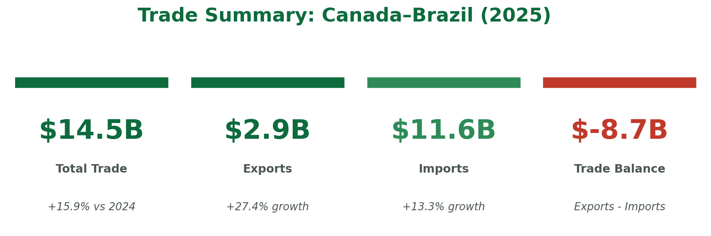
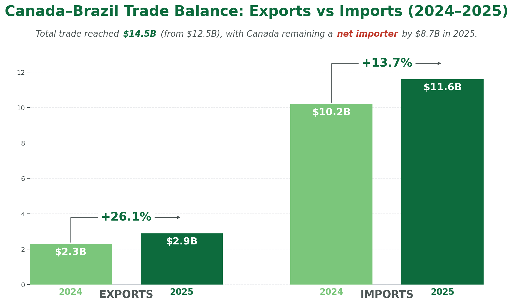
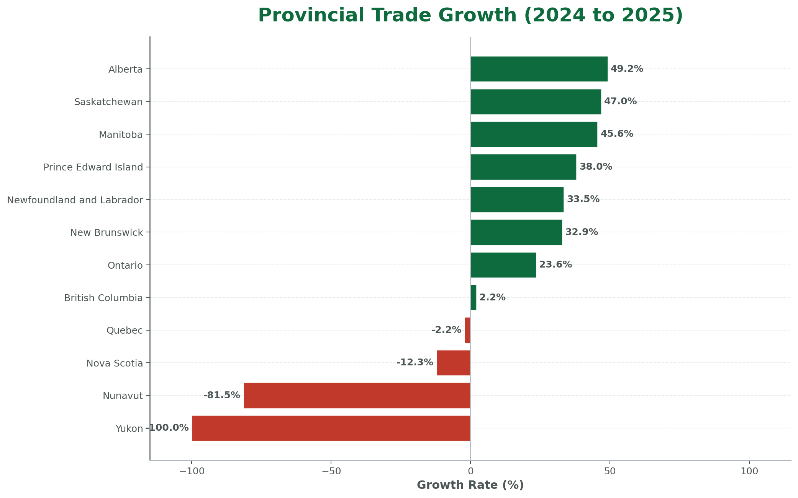

# Canada–Brazil Trade Opportunities Report

This project analyzes bilateral trade between Canada and Brazil to identify growth trends, regional concentration, and product-level opportunities. The work is structured as a professional reporting project, moving from data understanding and data cleaning to executive analysis and final report delivery.

## Executive Summary

The report evaluates trade performance across time, provinces, and product categories, with a focus on identifying where growth is concentrated and where decision-makers may find expansion opportunities or risk exposure. The project combines analytical rigor with business storytelling through a final HTML/PDF report supported by separate data understanding and data cleaning documents.

## Report Preview

### KPI Overview

<table>
  <tr>
    <td align="center" width="50%">
      
       
      Trade Balance
    </td>
    <td align="center" width="50%">
      
       
      Provincial Analysis
    </td>
  </tr>
</table>

## Reports

### Main Report
- [HTML Report](reports/trade-report.html)
- [PDF Report](reports/trade-report.pdf)

### Supporting Reports
- [01 Data Understanding Report](reports/01_data_understanding_report.pdf)
- [02 Data Cleaning Report](reports/02_data_cleaning_report.pdf)

## Project Highlights

- Trade performance analyzed across 2024 and 2025
- Provincial contribution reviewed to identify concentration and growth drivers
- Product-level performance examined to surface leading and declining sectors
- Forecasting included to support short-term directional planning
- Final outputs prepared in both HTML and PDF formats for presentation and sharing

## Analytical Scope

The project is designed to answer four core business questions:

1. How did Canada–Brazil trade perform over the analysis period?
2. Which provinces contributed most to growth and concentration?
3. Which product groups showed the strongest expansion or decline?
4. What does the short-term outlook suggest for future trade direction?

## Methodology

The workflow follows a structured analytical process:

1. Data understanding  
   Review dataset structure, field quality, and reporting scope.

2. Data cleaning  
   Standardize columns, handle missing values, and prepare the dataset for analysis.

3. Trade analysis  
   Measure total trade, exports, imports, and trade balance across time.

4. Provincial and product analysis  
   Identify concentration patterns, leading contributors, and category-level changes.

5. Forecasting  
   Estimate short-term direction using a time-series approach and summarize confidence.

6. Executive reporting  
   Present insights in a decision-ready format using charts, narrative, and report outputs.

## Tools Used

- Python
- Pandas
- NumPy
- Matplotlib
- Prophet / forecasting methods
- Jinja2
- WeasyPrint

## Repository Structure

    canada-brazil-trade-report/
    ├── README.md
    ├── data/
    │   ├── raw/
    │   └── clean/
    ├── notebooks/
    ├── reports/
    │   ├── trade-report.html
    │   ├── trade-report.pdf
    │   ├── 01_data_understanding_report.pdf
    │   ├── 02_data_cleaning_report.pdf
    │   └── report_images/
    ├── docs/
    └── requirements.txt

## Why This Project Matters

This project demonstrates the ability to take a business-oriented dataset and turn it into a complete analytical deliverable. It shows practical skills in data preparation, visualization, reporting, and communication, with outputs designed for both technical review and executive consumption.
